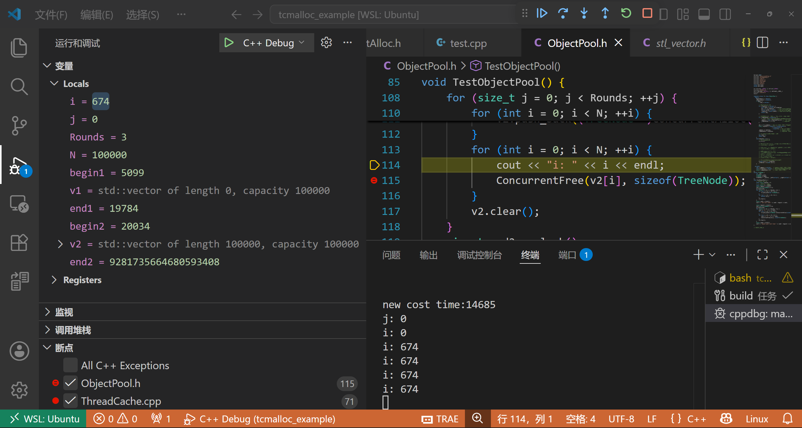
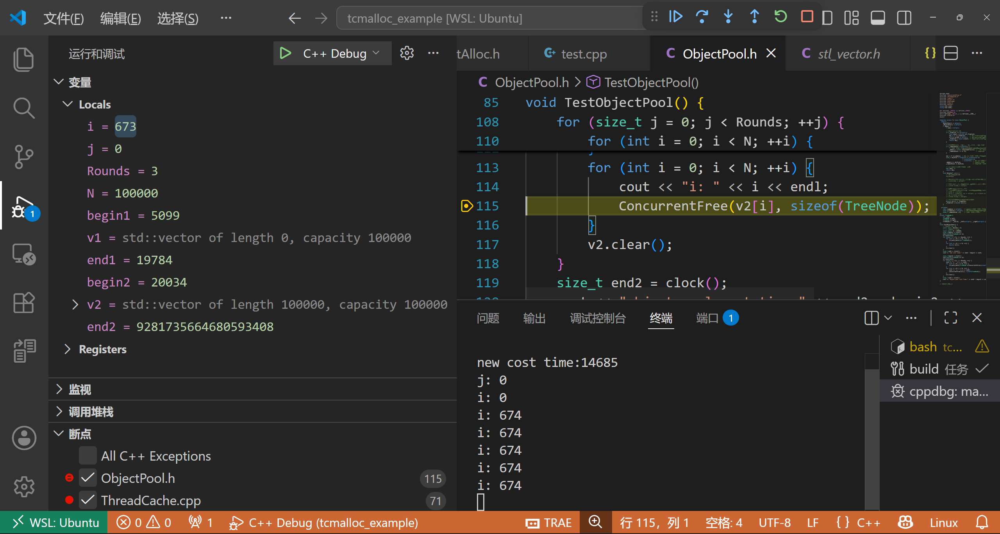

# tcmalloc_example
一个C++的高性能内存池

## 功能

学习tcmalloc的实现原理，实现一个简单的内存池

## 使用方式

使用 ConcurrentAlloc 和 ConcurrentFree 函数申请和释放内存块

```c++
#include "ConcurrentAlloc.h"

int main()
{
    void* ptr = ConcurrentAlloc(1024);
    ConcurrentFree(ptr, 1024);
    return 0;
}
```

## todo

不知道为什么，使用 `ConcurrentAlloc` 申请 100000 个24字节的内存块，然后使用 `ConcurrentFree` 释放，会导致在第 673 次释放时，程序会莫名让i++之后，i的值会变成 673。

是的，我没有描述错误，就是i的值会变成 673。



我发誓，我只按了一下F10，然后这个i就突然变成673。


